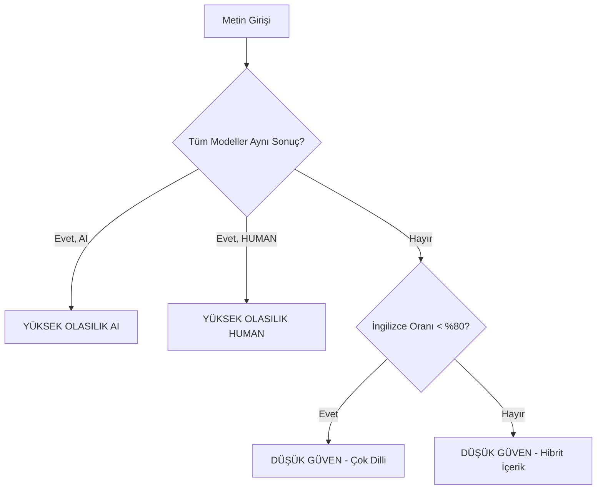

# 🤖 ScriptaNet - AI/Human Text Detector

[](https://www.python.org/)
[](https://flask.palletsprojects.com/)
[](https://pytorch.org/)
[](LICENSE)

**ScriptaNet**, metinlerin yapay zeka veya insan tarafından yazılıp yazılmadığını tespit eden gelişmiş bir makine öğrenimi sistemidir. Üç farklı model kullanarak yüksek doğrulukla tahmin yapar ve ağırlıklı ortalama ile nihai sonucu belirler.

## 🌟 Özellikler

### 🧠 Çok Modelli Tahmin Sistemi
- **RoBERTa** (30% ağırlık): Transformer tabanlı derin öğrenme modeli
- **Random Forest** (30% ağırlık): Ensemble learning yaklaşımı
- **XGBoost** (40% ağırlık): Gradient boosting ile güçlendirilmiş karar ağaçları

### ✨ Gelişmiş Özellikler
- 🌍 **Dil Kontrolü**: İngilizce metin oranı otomatik tespit edilir
- 📊 **Ağırlıklı Ortalama**: Modellerin tahminleri özel ağırlıklarla birleştirilir
- 🎯 **Akıllı Karar Mekanizması**: Modeller arası tutarlılık kontrolü
- 🔍 **Metin Validasyonu**: Minimum 30 kelime kontrolü
- 🌐 **Modern Web Arayüzü**: Kullanıcı dostu Flask tabanlı UI
- ⚡ **Gerçek Zamanlı Analiz**: Hızlı ve etkili tahmin

## 🏗️ Mimari

```
┌──────────────────────────────────────────────┐
│           Web Arayüzü (Flask)                │
│         templates/index.html                 │
└──────────────────┬───────────────────────────┘
                   │
                   ▼
         ┌─────────────────┐
         │   app.py        │
         │  (Main Backend) │
         └────────┬────────┘
                  │
      ┌───────────┼───────────┐
      ▼           ▼           ▼
┌──────────┐ ┌─────────┐ ┌─────────┐
│ RoBERTa  │ │   RF    │ │  XGBost │
│  (30%)   │ │  (30%)  │ │  (40%)  │
└──────────┘ └─────────┘ └─────────┘
      │           │           │
      └───────────┼───────────┘
                  ▼
         ┌────────────────┐
         │ Weighted Avg   │
         │   Algorithm    │
         └────────┬───────┘
                  ▼
            ┌──────────┐
            │  Sonuç   │
            └──────────┘
```

## 📋 Gereksinimler

### Sistem Gereksinimleri
- Python 3.8 veya üzeri
- 4GB RAM (minimum)
- 2GB Disk Alanı (model dosyaları için)

### Python Bağımlılıkları
```
flask==3.0.0
transformers==4.35.2
torch==2.1.0
joblib==1.3.2
xgboost==2.0.2
scikit-learn==1.3.2
langdetect==1.0.9
numpy==1.26.2
pandas==2.1.3
```

### Test Bağımlılıkları (Opsiyonel)
```
pytest>=9.0.0
selenium>=4.0.0
webdriver-manager>=4.0.0
```

## 🚀 Kurulum

### 1. Projeyi Klonlayın
```bash
git clone https://github.com/EmreTYucel/ScriptaNet-Ai-Human-Text-Detector.git
cd ScriptaNet-Ai-Human-Text-Detector
```

### 2. Sanal Ortam Oluşturun (Önerilir)
```bash
# Windows
python -m venv venv
venv\Scripts\activate

# Linux/Mac
python3 -m venv venv
source venv/bin/activate
```

### 3. Bağımlılıkları Yükleyin
```bash
pip install -r requirements.txt
```

### 4. Model Dosyalarını İndirin
Projenin çalışması için aşağıdaki model dosyalarına ihtiyaç vardır:

```
├── rf_model.pkl                  # Random Forest modeli
├── tfidf_vectorizer.pkl          # TF-IDF vektörleştirici
├── xgb_150trees.joblib           # XGBoost modeli
├── tfidf_word.joblib             # Kelime bazlı TF-IDF
├── tfidf_char.joblib             # Karakter bazlı TF-IDF
└── roberta_model_folder/         # RoBERTa model klasörü
```

**Not:** Model dosyaları büyük olduğundan GitHub'a yüklenmemiştir. Model dosyalarını proje ekibinden temin edin.

## 💻 Kullanım

### Flask Uygulamasını Başlatma

```bash
python app.py
```

Uygulama başarıyla başladığında:
- **URL**: `http://127.0.0.1:5000`
- Tarayıcınızda bu adresi açarak web arayüzüne erişebilirsiniz

### API Kullanımı

#### POST /predict
Metin analizi yapmak için kullanılır.

**İstek:**
```json
{
  "text": "Your text here that needs to be analyzed for AI detection..."
}
```

**Başarılı Yanıt (200):**
```json
{
  "banner": {
    "title": "YÜKSEK OLASILIK (AI)",
    "desc": "Tüm modeller metnin yapay zeka üretimi olduğunu gösteriyor."
  },
  "results": [
    {
      "name": "RoBERTa",
      "label": "AI",
      "ai_pct": 85.23,
      "human_pct": 14.77
    },
    {
      "name": "RandomForest",
      "label": "AI",
      "ai_pct": 78.45,
      "human_pct": 21.55
    },
    {
      "name": "XGBoosting",
      "label": "AI",
      "ai_pct": 82.10,
      "human_pct": 17.90
    }
  ],
  "aggregate": {
    "name": "WeightedAverage",
    "label": "AI",
    "ai_pct": 81.89,
    "human_pct": 18.11,
    "weights": {
      "RoBERTa": 0.3,
      "RandomForest": 0.3,
      "XGBoosting": 0.4
    }
  },
  "lang": {
    "english_ratio": 0.95,
    "min_words": 30,
    "threshold": 0.8
  }
}
```

**Hata Yanıtları:**
- `400`: Geçersiz istek (kısa metin, desteklenmeyen dil vb.)
- `500`: Sunucu hatası

### Örnek Curl Komutu

```bash
curl -X POST http://127.0.0.1:5000/predict \
  -H "Content-Type: application/json" \
  -d '{"text": "This is a sufficiently long English text designed to pass the minimum word threshold. It contains multiple sentences and clear English structure so that language detection and ratio checks do not block the analysis process."}'
```

## 🧪 Testler

Proje, backend ve UI için kapsamlı white-box testleri içerir.

### Backend Testlerini Çalıştırma
```bash
python -m pytest tests/test_backend_whitebox.py -v
```

**Test Kapsamı:**
- ✅ Model tahminlerinin doğruluğu
- ✅ Ağırlıklı ortalama hesaplaması
- ✅ Banner mesajlarının kontrolü
- ✅ Dil oranı validasyonu

### UI Testlerini Çalıştırma
**Not:** Flask uygulaması çalışıyor olmalıdır.

```bash
# 1. Terminal: Flask'ı başlat
python app.py

# 2. Terminal: UI testlerini çalıştır
python -m pytest templates/tests/test_ui_whitebox.py -v
```

**Test Kapsamı:**
- ✅ Temizle butonu işlevselliği
- ✅ Analiz butonu ve sonuç gösterimi
- ✅ Hata mesajlarının görüntülenmesi
- ✅ UI state yönetimi

### Tüm Testleri Çalıştırma
```bash
python -m pytest -v
```

## 📊 Model Detayları

### RoBERTa (Robustly Optimized BERT)
- **Tip**: Transformer-based Deep Learning
- **Ağırlık**: 30%
- **Özellik**: Context-aware token embeddings
- **Max Length**: 512 token

### Random Forest
- **Tip**: Ensemble Learning (Bagging)
- **Ağırlık**: 30%
- **Özellik**: TF-IDF vektörleştirme
- **Avantaj**: Overfitting'e karşı dayanıklı

### XGBoost (Extreme Gradient Boosting)
- **Tip**: Ensemble Learning (Boosting)
- **Ağırlık**: 40% (En yüksek)
- **Özellik**: Kelime + Karakter TF-IDF kombinasyonu
- **Parametre**: 150 ağaç

### Ağırlıklı Ortalama Hesaplama

```
Weighted_AI% = (RoBERTa_AI% × 0.30) + 
               (RF_AI% × 0.30) + 
               (XGB_AI% × 0.40)
```

**Örnek:**
- RoBERTa: 85% AI
- RandomForest: 78% AI
- XGBoost: 82% AI

```
Weighted = (85 × 0.30) + (78 × 0.30) + (82 × 0.40)
         = 25.5 + 23.4 + 32.8
         = 81.7% AI
```

## 🛡️ Validasyonlar

### Metin Gereksinimleri
| Kriter | Değer | Açıklama |
|--------|-------|----------|
| **Minimum Kelime** | 30 | Anlamlı analiz için gerekli |
| **Dil Kontrolü** | %30 İngilizce | Minimum kabul oranı |
| **Önerilen Dil** | %80+ İngilizce | Yüksek güven için |
| **Boş Metin** | ❌ Kabul Edilmez | Metin zorunlu |

### Banner Karar Mekanizması



## 📁 Proje Yapısı

```
ScriptaNet-Ai-Human-Text-Detector/
│
├── app.py                          # Ana Flask uygulaması
├── requirements.txt                # Python bağımlılıkları
├── README.md                       # Proje dokümantasyonu
├── TEST_REHBERI.md                # Test kılavuzu
│
├── templates/                      # Flask şablonları
│   ├── index.html                  # Web arayüzü
│   └── tests/
│       └── test_ui_whitebox.py    # UI white-box testleri
│
├── tests/                          # Backend testleri
│   └── test_backend_whitebox.py   # Backend white-box testleri
│
└── models/                         # Model dosyaları (not included)
    ├── rf_model.pkl
    ├── tfidf_vectorizer.pkl
    ├── xgb_150trees.joblib
    ├── tfidf_word.joblib
    ├── tfidf_char.joblib
    └── roberta_model_folder/
```

## 🎯 Kullanım Senaryoları

### 1. Akademik Dürüstlük Kontrolü
Öğrenci ödevlerinin AI tarafından yazılıp yazılmadığını tespit edin.

### 2. İçerik Doğrulama
Blog yazıları, makaleler ve raporların orijinalliğini kontrol edin.

### 3. Sosyal Medya Analizi
Sosyal medya gönderilerinin bot veya insan tarafından yazıldığını belirleyin.

### 4. Kalite Kontrol
İçerik üretim süreçlerinde AI kullanımını izleyin.

## ⚙️ Yapılandırma

`app.py` içinde özelleştirilebilir parametreler:

```python
# Minimum kelime sayısı
MIN_WORDS = 30

# İngilizce metin eşik değeri
ENGLISH_RATIO_THRESHOLD = 0.80

# Model ağırlıkları (toplam 1.0 olmalı)
WEIGHTS = {
    "RoBERTa": 0.30,
    "RandomForest": 0.30,
    "XGBoosting": 0.40
}
```

## 🔧 Sorun Giderme

### Model Yükleme Hatası
```
FileNotFoundError: [Errno 2] No such file or directory: 'rf_model.pkl'
```
**Çözüm:** Model dosyalarının proje kök dizininde olduğundan emin olun.

### Port Kullanımda Hatası
```
OSError: [Errno 48] Address already in use
```
**Çözüm:** Farklı bir port kullanın:
```python
app.run(debug=True, port=5001)
```

### Import Hatası (Testler)
```
ModuleNotFoundError: No module named 'app'
```
**Çözüm:** Testleri proje kök dizininden çalıştırın:
```bash
python -m pytest tests/test_backend_whitebox.py -v
```

## 📈 Performans

| Metrik | Değer |
|--------|-------|
| **Ortalama Yanıt Süresi** | ~2-3 saniye |
| **Model Yükleme Süresi** | ~10 saniye |
| **RAM Kullanımı** | ~2-3 GB |
| **CPU Kullanımı** | Orta-Yüksek |

**Optimizasyon İpuçları:**
- GPU kullanımı için PyTorch CUDA versiyonunu yükleyin
- Batch işleme için API'yi genişletin
- Cache mekanizması ekleyin

## 🤝 Katkıda Bulunma

Katkılarınızı bekliyoruz! Lütfen aşağıdaki adımları izleyin:

1. Fork yapın
2. Feature branch oluşturun (`git checkout -b feature/amazing-feature`)
3. Değişikliklerinizi commit edin (`git commit -m 'Add amazing feature'`)
4. Branch'inizi push edin (`git push origin feature/amazing-feature`)
5. Pull Request açın

## 📝 Lisans

Bu proje MIT lisansı altında lisanslanmıştır. Detaylar için [LICENSE](LICENSE) dosyasına bakın.

## 👥 Ekip

- **Proje Sahibi**: EmreTYucel
- **Katılımcılar**: [Katkıda bulunanlar için teşekkürler!]

## 📞 İletişim

Sorularınız veya önerileriniz için:
- GitHub Issues: [Yeni Issue Aç](https://github.com/EmreTYucel/ScriptaNet-Ai-Human-Text-Detector/issues)
- Email: [Projenize email ekleyin]

## 🙏 Teşekkürler

- **Hugging Face** - RoBERTa model desteği için
- **scikit-learn** - Machine learning altyapısı için
- **Flask** - Web framework için
- **PyTorch** - Deep learning altyapısı için

---

<p align="center">
  Made with ❤️ by ScriptaNet Team
</p>

<p align="center">
  ⭐ Projeyi beğendiyseniz yıldız vermeyi unutmayın!
</p>
